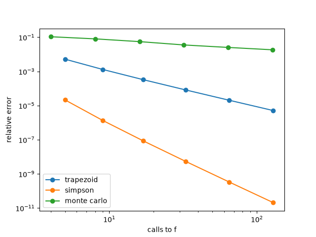

# How wrong are the rectangles?

The goal of this project is to compare three ways of computing an area under a curve (the trapezoid rule, Simpson's rule and Monte Carlo), find out which one gives the most accuracy for the least work, and see whether the winner changes as the problem goes from 1 dimension up to 8 dimensions.

I tutor maths on the side, and this project started while I was going through the Fundamental Theorem of Calculus with a high school student. I don't like opening with "an integral is the area under the curve", because that skips the idea behind it.

Say f(x) is the slope of F(x). Take an infinitely small step along the x-axis and call it dx. Over that step, F goes up by slope * step, so f(x) * dx. Now walk from a to b in these tiny steps and add up every rise. All the rises together are exactly how much F changed from start to finish, F(b) - F(a).

Now look at f(x) * dx on the graph of f. In the integral, dx stands for an infinitely small width. The slope f(x) is a height and dx is a width, so each rise of F is a thin rectangle standing under the graph of f. Over an infinitely thin width, the rectangle matches the curve and so its area is exactly the rise. That's why the area under the slope curve is the total change of F: in the limit, the area is all the little rises put side by side.

But a real step can never be infinitely small. With a real width, the rectangle's flat top can't follow the curve, so each rectangle is a little off from the true rise, and there is always some error (adding up these rectangles is called a Riemann sum). The thinner the rectangles, the closer their tops follow the curve and the smaller the error, but it never fully goes away. So the integral, the exact area, is the target. F(b) - F(a) reaches it directly, while a Riemann sum only gets closer and closer, and the integral is its limit.

So if you can find F, you don't need rectangles at all. The problem is that for most functions you can't find F (the antiderivative). Then the only option is to go back to rectangles, or better shapes like trapezoids (the trapezoid rule) or parabolas (Simpson's rule), and accept a small error.

While I was explaining that, I got curious. A computer can never compute infinitely many rectangles, it always has to stop somewhere. So how close does it actually get? Are there better shapes than rectangles? And if you want to get closer, what is the cheapest way to do it? It seemed like a "fun" thing to find out, so I tried building it.

## The question

What is the cheapest way to compute an area under a curve, and does the answer change when the problem gets bigger, meaning more dimensions?

"Cheap" needs a unit. I measure effort as the number of times a method asks for a value of f. Here f is just e^x, so each call is instant. But in real world problems (pricing in finance, for example) getting one value of f can mean running a whole simulation. The total time is the number of calls * the time of one call, and the only part a method can change is the number of calls. That's why every plot has calls on the x-axis and error on the y-axis. Trapezoid and Simpson cut the interval the same way, so for the same n they ask f at the same n + 1 posts and make exactly the same number of calls. They only weight the posts differently. Monte Carlo makes one call per random point, so I gave it about as many points as the grids make calls. That way, at each dot on a plot, the three methods did the same amount of work, and the only difference is how big their error is. The lowest dot did the best job.

## Why we need approximations at all

For f(x) = x^2 on [1, 3], F(x) = x^3 / 3, so the area is 27/3 - 1/3 = 26/3, no rectangles needed. But for e^(-x^2), the bell curve, it has been proven that no formula made of the usual functions gives you F. The area exists, you just can't write it as F(b) - F(a). That's when you need a numerical method. A computer can't take a limit, so it always stops at some finite number of pieces, and the gap between where it stops and the true answer is the error this project measures.

## The three methods

The plain rectangle sum from the opening is the starting point. The first two methods keep the grid but use better shapes, and the third does something completely different. 

All three cut the interval [a, b] into n pieces of equal width h = (b - a) / n. To make n pieces, you need n + 1 posts (boundary points), numbered 0 to n. Post k sits at a + k * h.

### Trapezoid rule

Instead of a flat lid on each piece, join the two corner heights with a straight line, so the lid tilts with the curve. Each piece is a trapezoid with area h * (left height + right height) / 2, so each piece uses its two corner heights at half weight. An inside post is a corner of two pieces, so it gets 1/2 from the piece on its left and 1/2 from the piece on its right, which makes 1. The two end posts are corners of only one piece each, so they keep 1/2: 

h * (1/2 f(post 0) + f(post 1) + ... + f(post n-1) + 1/2 f(post n))

For example with n = 4 there are 5 posts, and their weights are 1/2, 1, 1, 1, 1/2.

### Simpson's rule

The trapezoid lid is a straight line that tilts, so it can't follow a curve that bends. Simpson's rule uses a curved lid instead, a parabola. A straight line needs two points, but a parabola needs three, so one piece with its two corner posts isn't enough. Simpson's rule takes two neighbouring pieces together. Each is still h wide, so together they are 2h wide, with three posts: left, middle and right. It draws one parabola through those three heights and takes the area under it.

Why 4? Over the same 2h, there are two simple estimates of the area. The first is a trapezoid lid from f(left) to f(right), skipping the middle post: 2h * (f(left) + f(right)) / 2 = h * (f(left) + f(right)). The second is a flat lid at height f(middle), one big rectangle: 2h * f(middle). When the curve bends upwards, the trapezoid lid sits above the curve and comes out too big, and the flat lid comes out too small. Under a parabola, the flat lid misses exactly by half as much as the trapezoid lid. You can check this on x^2 from 1 to 2: the true area is 2.333, the trapezoid lid gives 2.5 (0.167 too big) and the flat lid gives 2.25 (0.083 too small). So one trapezoid area miss is cancelled by two flat lid area misses. Simpson's rule adds 1 trapezoid estimate and 2 flat lid estimates and divides by 3. That average is the area under the parabola:

(h * (f(left) + f(right)) + 2 * 2h * f(middle)) / 3 = h/3 * (f(left) + 4 f(middle) + f(right))

Now do this for every pair along [a, b]. The pairs sit side by side, so the right post of one pair is the left post of the next. That shared post gets 1 from each pair, which makes 2. The middle posts get 4, and the two end posts of the whole interval keep 1:

h/3 * (f(post 0) + 4 f(post 1) + 2 f(post 2) + 4 f(post 3) + ... + 4 f(post n-1) + f(post n))

For example with n = 4 there are 5 posts, and their weights are 1, 4, 2, 4, 1. Because it works in pairs, n has to be even.

If the function is itself a parabola, like x^2, the lid sits exactly on it and Simpson's rule gives the exact area. For any other curve, like e^x, each lid is only a close estimate, and the small gap between the lid and the curve of the function is the error. 

### Monte Carlo

This one throws the grid away and uses a different way to estimate an area: area = average height * width. Pick n random x-values between a and b, look up f at each one, take the average, and multiply by b - a. 

## Testing before anything else

The first thing I wrote was a test, before any method existed. A test is a known right answer the code as to reach. The first one was the trapezoid rule on x^2 over [1, 3], which must give 26/3. 

I picked [1, 3] on purpose. On [0, 1], two common bugs are invisible: forgetting the "a +" in a + k * h changes nothing because a = 0, and forgetting to multiply by b - a changes nothing because b - a = 1. On [1, 3] both bugs give a wrong answer and the test catches them.

Then came Simpson and Monte Carlo with the same test. Simpson is exact on x^2 (a parabola), so that test only catches bugs. So I added tests on e^x over [0, 1]: it isn't a parabola, so every method leaves a real error, its exact answer is known (e - 1), and it extends to any dimension as e^(x1 + ... + xd), with exact answer (e - 1)^d. It is on [0, 1] because later everything is on the unit cube, and the [1, 3] test already catches the two hidden bugs. Monte Carlo is random, so its tests fix the random seed (the same "random" numbers every run) and allow 1% error, where the grid tests allow 0.1%.

There are 13 tests in the end and they all pass.

## Counting calls

To measure effort I wrapped f in a small function that adds 1 to a counter everytime f is called, so every method could report exactly how many calls it made.

The counter showed a problem straight away. My first trapezoid and Simpson code asked for some posts twice. In the trapezoid, every inside post was asked once as the right edge of one piece and once as the left edge of the next. In Simpson, the post where two pairs meet was asked once by each pair. Same answer, wasted calls. I rewrote both to ask each post once and use weights instead (1/2 and 1 for trapezoid, 1, 4, 2 for Simpson). The answer stayed the same and calls dropped to n + 1.

I also switched to relative error at this point: abs(estimate - exact) / exact. That makes errors comparable between integrals of different sizes, which matters later because the exact answer grows with the dimension.

## Results in 1D

For each method, I ran n = 4, 8, 16, 32, 64, 128 and plotted error against calls on log-log axes. On a log-log plot a straight line means everytime you double the effort, the error shrinks by the same factor, so that factor is what to compare.

Monte Carlo gives a different answer every run, so one run is partly luck. For each n I ran it with 100 different seeds and averaged the error, to get the typical error instead of a lucky or unlucky one.

Doubling the calls cut the trapezoid error by 4, the Simpson error by 16, and the Monte Carlo error by only about 1.4. Monte Carlo needs 4 times the calls just to halve its error.

Why these numbers? Doubling n splits every piece in two, so each gap between the lid and the curve is replaced by two new ones. For the trapezoid rule, each new gap is about 1/8 the size of the old one. It is half as wide, and because the curve has only half the distance to bend away from the trapezoid lid, it is about 1/4 as tall. Two gaps of 1/8 make 1/4 of the old error.

Simpson's lid is a parabola, which already bends with the curve, so the gap leftover is smaller and shrinks faster: each new gap is about 1/32 of the old one, and two of them make 1/16.

Monte Carlo has no pieces and no gaps, so this reasoning does not apply to it. Its error comes from which random points it happened to pick. In my results it needed 4 times the calls to halve the error, so doubling the calls only divided the error by about 1.4. Some random points land too high and some too low, and they partly cancel out, but slowly.

So in 1D the grids win easily, and Simpson most of all.